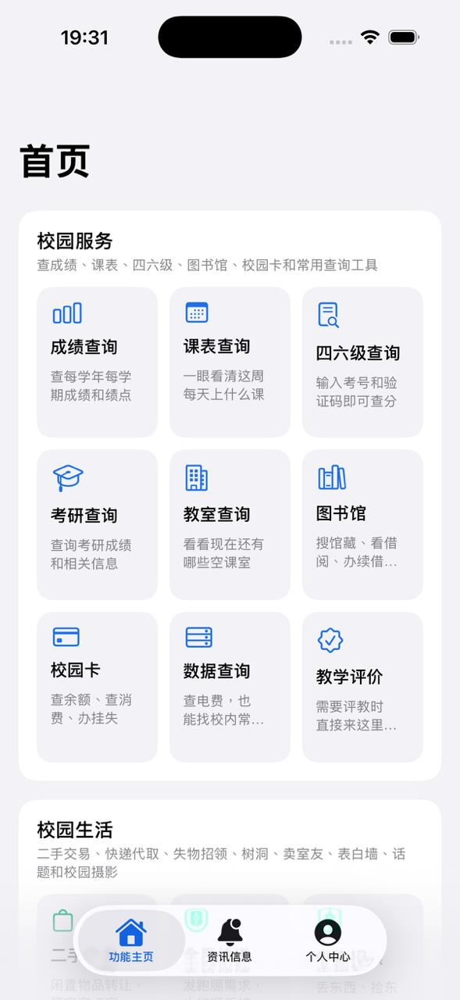
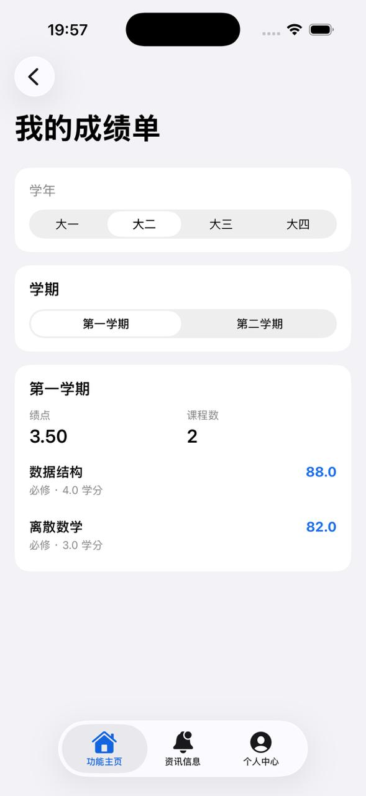
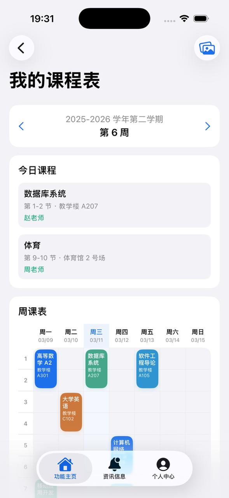

# 广东二师助手 iOS 客户端

广东二师助手 iOS 客户端，基于 SwiftUI 构建，面向广东第二师范学院校园场景，覆盖教务查询、校园生活与信息通知等核心能力。

## 功能概览

### 校园服务

- 成绩查询
- 课表查询
- 四六级查询
- 考研查询
- 教室查询
- 图书馆
- 校园卡
- 数据查询
- 教学评价

### 校园生活

- 二手交易
- 全民快递
- 失物招领
- 校园树洞
- 卖室友
- 表白墙
- 校园话题
- 拍好校园

### 资讯信息

- 新闻通知
- 系统通知公告
- 互动消息

### 个人中心

- 资料展示与编辑
- 头像管理
- 绑定手机
- 绑定邮箱
- 隐私设置
- 登录记录
- 下载个人数据
- 反馈
- 设置
- 退出登录

## 技术栈

- Swift
- SwiftUI
- MVVM
- Repository Pattern
- URLSession
- Keychain
- JWT 前后端分离登录态

## 工程结构

```text
GdeiAssistant-iOS/
├── App/
├── Core/
│   ├── Auth/
│   ├── Config/
│   ├── DesignSystem/
│   ├── Networking/
│   ├── Storage/
│   └── Utils/
├── Features/
│   ├── Auth/
│   ├── Home/
│   ├── Messages/
│   ├── Profile/
│   ├── Schedule/
│   ├── Grade/
│   ├── Card/
│   ├── Library/
│   ├── CET/
│   ├── Marketplace/
│   ├── LostFound/
│   ├── Secret/
│   ├── Dating/
│   ├── Delivery/
│   ├── Express/
│   ├── Topic/
│   ├── Photograph/
│   ├── DataCenter/
│   ├── GraduateExam/
│   ├── Spare/
│   ├── Evaluate/
│   └── News/
└── Mock/
```

每个业务模块默认按以下层次拆分：

- `Models`
- `DTOs`
- `Mappers`
- `Repositories`
- `ViewModels`
- `Views`

## 架构说明

### 1. 数据源模式

项目支持两种数据源：

- `remote`：请求真实后端接口
- `mock`：使用本地模拟数据

切换入口位于设置页，调试阶段可直接切换并即时生效。

### 2. 登录态管理

登录链路由以下组件协作完成：

- `AuthManager`：登录、登出、恢复登录态、401 失效处理
- `SessionState`：全局登录状态和当前用户
- `KeychainTokenStorage`：JWT 本地安全存储
- `AuthRepository`：按环境切换 `mock` / `remote`

### 3. 网络层

网络层基于 `URLSession`，统一负责：

- 请求构建
- Header 注入
- Bearer Token 注入
- `X-Client-Type: IOS` 注入
- JSON 解码
- 错误归一化
- 401 与登录失效处理

### 4. DTO / Domain 分层

业务模块中的远端数据不直接进入 View。当前工程统一采用：

- `DTO`：承接后端返回结构
- `Mapper`：完成 DTO -> Domain Model 映射
- `Repository`：对 ViewModel 暴露稳定的数据访问接口

## 运行环境

- Xcode 15 及以上
- iOS 17 SDK（建议）
- macOS 环境已安装完整 Xcode，而非仅 Command Line Tools

若本机 `xcode-select` 未指向完整 Xcode，请先执行：

```bash
sudo xcode-select -s /Applications/Xcode.app/Contents/Developer
```

## 快速开始

### 1. 打开工程

```bash
open GdeiAssistant-iOS.xcodeproj
```

### 2. 命令行构建

```bash
DEVELOPER_DIR=/Applications/Xcode.app/Contents/Developer \
xcodebuild -project GdeiAssistant-iOS.xcodeproj \
-scheme GdeiAssistant-iOS \
-destination 'generic/platform=iOS' \
CODE_SIGNING_ALLOWED=NO CODE_SIGNING_REQUIRED=NO build
```

### 3. 运行方式

- `mock` 模式：适合本地联调 UI 和主链路验证
- `remote` 模式：适合接入真实后端接口

## Mock 模式说明

调试环境默认支持 `mock` 数据源。

当前 mock 登录账号：

- 用户名：`gdeiassistant`
- 密码：`gdeiassistant`

当设置页启用 mock 后：

- 登录页会显示 mock 账号提示
- 登录链路会使用 `MockAuthRepository`
- 不会发起真实 `/auth/login` 请求


## 后端接口位置

本项目对应的后端仓库为：

- GitHub：`https://github.com/GdeiAssistant/GdeiAssistant`

## 应用截图

<p>
  
  
  
</p>

## 开源协议

本项目采用 [Apache License 2.0](LICENSE) 开源协议。

你可以在遵守协议条款的前提下使用、修改和分发本项目代码。

## 免责声明

1. 本项目为校园场景应用客户端，功能和数据能力以学校实际开放范围、后端接口能力及账号权限为准。
2. 仓库中的 `mock` 数据仅用于本地开发和界面联调，不代表真实校园业务数据。
3. 本项目不对因第三方服务异常、学校系统调整、网络问题或接口变更导致的功能不可用承担责任。
4. 使用者在接入真实后端或部署衍生版本时，应自行确保账号、隐私、日志和数据安全合规。
